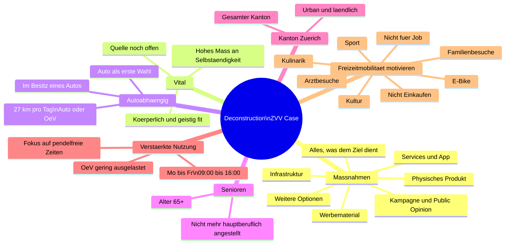

# Deconstruction Mindmap (17.04.2026)

```mermaid
mindmap
  root((Deconstruction\nZVV Case))
    Massnahmen
      Alles, was dem Ziel dient
      Physisches Produkt
      Infrastruktur
      Kampagne und Public Opinion
      Werbematerial
      Services und App
      Weitere Optionen
    Vital
      Koerperlich und geistig fit
      Hohes Mass an Selbstaendigkeit
      Quelle noch offen
    Autoabhaengig
      Im Besitz eines Autos
      Auto als erste Wahl
      27 km pro Tag\nAuto oder OeV
    Senioren
      Alter 65+
      Nicht mehr hauptberuflich angestellt
    Kanton Zuerich
      Gesamter Kanton
      Urban und laendlich
    Verstaerkte Nutzung
      Fokus auf pendelfreie Zeiten
      OeV gering ausgelastet
      Mo bis Fr\n09:00 bis 16:00
    Freizeitmobilitaet motivieren
      Nicht fuer Job
      Familienbesuche
      Arztbesuche
      Nicht Einkaufen
      Kulinarik
      Kultur
      Sport
      E-Bike
```
